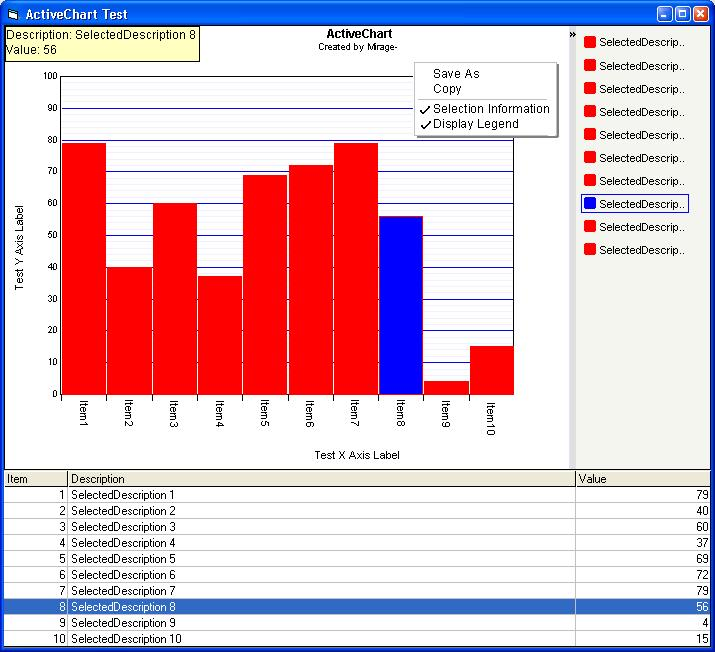



## ActiveChart UPDT \(Bar\)

### Description

Custom barchart control with simple user interactivity. Fixed resize bug. Please vote and leave any comments/feedback so that I can continue to enhance the control. Thanks for your interest in my work.
 
### More Info
 

             |
---                |---
**Submitted On**   |2002-03-11 14:36:52
**By**             |[Mirage\-](https://github.com/Planet-Source-Code/PSCIndex/blob/master/ByAuthor/mirage.md)
**Level**          |Intermediate
**User Rating**    |4.6 (37 globes from 8 users)
**Compatibility**  |VB 6\.0
**Category**       |[Custom Controls/ Forms/  Menus](https://github.com/Planet-Source-Code/PSCIndex/blob/master/ByCategory/custom-controls-forms-menus__1-4.md)
**World**          |[Visual Basic](https://github.com/Planet-Source-Code/PSCIndex/blob/master/ByWorld/visual-basic.md)
**Archive File**   |[ActiveChar612163112002\.zip](https://github.com/Planet-Source-Code/mirage-activechart-updt-bar__1-32583/archive/master.zip)

